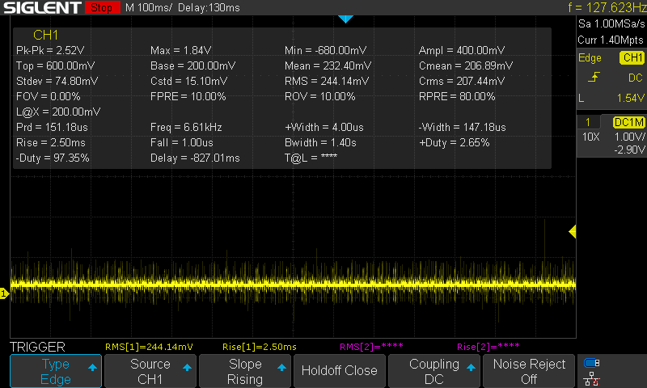
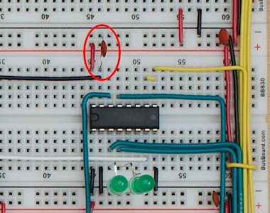
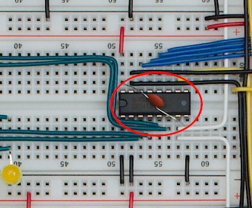
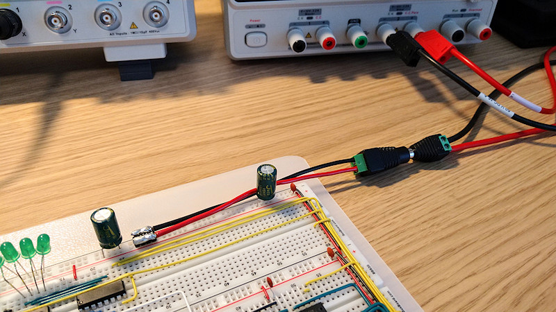
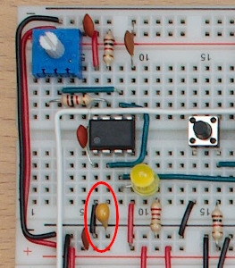

# Issues

I ran into many issues trying to get the 8-bit computer to work. This is my
documentation of the issues and the fixes.

## LEDs without resistors

I started by following the videos step by step, and when it came to testing the
first register I couldn't get it to work. The red LEDs on the register would be
very faint and randomly on/off, and the yellow LEDs on the temporary bus would
not light up at all.

The booklet that came with the kit suggested adding resistors to the LEDs, but
there wasn't any room on the breadboard for that. I found a good tip in this
post on reddit: [What I Have Learned (a master list of what to do and what not
to
do)](https://www.reddit.com/r/beneater/comments/dskbug/what_i_have_learned_a_master_list_of_what_to_do/)

I soldered resistors to the LEDs as suggested, and the register started working
like in the video.

I grew tired of soldering resistors to all the LEDs, so I went for LEDs with
resistors built-in instead:

* [Kingbright L-7113ID-5V - 5v Red
  LED](https://no.rs-online.com/web/p/leds/8609709/)
* [Kingbright L-7113GD-5V - 5v Green
  LED](https://no.rs-online.com/web/p/leds/8609696/)
* [Kingbright L-7113YD-5V - 5v Yellow
  LED](https://no.rs-online.com/web/p/leds/8609712/)
* [VCC LTH5MM12VFR4600 - 12v Clear Blue
  LED](https://www.digikey.no/product-detail/en/visual-communications-company-vcc/LTH5MM12VFR4600/LTH5MM12VFR4600-ND/6691221)

The red, green and yellow LEDs were directly replaceable with the 5v ones from
Kingbright, but I could not find any of the blue kind. Most of the blue LEDs are
in positions with room for a resistor on the breadboard, so I kept the original
ones. I soldered resistors only on the 4 used in the instruction register, seen
in the picture above.

The blue were a bit bright with the 220Ω resistors, so I went with 1kΩ resistors
on those.

I used the clear blue 12v LEDs for the ALU carry and zero bits (not the flags).
They are way too bright on 12v, but fine on 5v.

## Single stepping the clock leads to occasional double step

Video showcasing the glitch:

The video shows me single stepping the clock. After a few steps, we can see the
program counter going from `1000` to `1010` from one click of the button,
skipping very quickly past the expected value of `1001`. The oscilloscope in the
video shows the output from the button. Notice the very thin dip about 2/3 of
the way. This is enough for it to register as 2 clock ticks. The same can be
seen in this screenshot:

The problem is in the monostable 555 timer circuit that is supposed to handle
debouncing. The size of the capacitor used on pin 6 decides how long the
debounce lasts, and the capacitor used by default in the kit is 0.1μF (104).
This works fine usually, but not every time. Replacing it with a 0.33μF (334)
capacitor makes the debounce much more reliable.

## Long single step leads to spurious clock ticks

Video showcasing the glitch:

The video shows me single stepping the clock by holding the button down, and the
program counter increments at a very rapid rate. The oscilloscope in the video
shows the output from the button. Notice the amount of high frequency noise in
the signal from the button. The same can be seen in this screenshot:

This is related to the same monostable 555 timer circuit as in the previous
issue. But for some reason the signal is clean for a short period when first
pressing the button, but pretty soon it gets very noisy. I fixed it by replacing
the monostable timer that came with the kit, a Fairchild LM555CN, with a Texas
Instruments NE555P I had lying around.

The same test looks much better afterwards:

And the clock only ticks once when keeping the button pressed.

## Registers latching out of phase with the clock

Video showcasing the glitch:

The video shows a program running that should count from 0 to 15 in repeat. The
program counter and the bus are reacting much faster than the clock, and when
looking at the output display we can also see that it skips values, counting 0
-> 2 -> 5 -> 11 -> 15. I have a temporary configuration in place where I can
move between the original circuit and the fixed circuit to demonstrate that it
counts normal with the fixed circuit.

Everything seemed to work fine when building the RAM module and testing it in
isolation. However, when I started connecting the other modules the whole thing
started behaving erratic, like in the video.

The problem stems from the clock signal that goes into the NAND-gate on the
right, through the RC-circuit. The capacitor creates some resonance that travels
back through the clock wires and disturbs everything else connected to the same
clock, leading to registers latching out of phase with the actual clock.

This shows the original circuit:

And this shows the fixed circuit. The NAND-gate is used to isolate the clock
signal by running it through the inverter 2 times before being sent to the
RC-circuit.

More about this issue on Reddit: [What I Have
Learned](https://www.reddit.com/r/beneater/comments/dskbug/what_i_have_learned_a_master_list_of_what_to_do/).

## RAM mode switch changes memory content

Video showcasing the glitch:

The video shows repeated switching between run mode and programming mode on the
RAM module. The address set by the DIP switch is `1111`, and that address in RAM
contains the value `0000 1110`. The MAR itself is set to `0001` and that address
in RAM contains the value `1100 1111`. The first mode switches works fine, but
suddenly the value in RAM at address `0001` changes to `0000 0010`.

The reason can be seen on the oscilloscope:

The oscilloscope probe is connected to pin 12 of the 74LS157 (next to the
program button), that goes to pin 3 of the 74189, which is the active-low
write-enable pin. The signal should be high when it's not writing to the RAM,
but sometimes there is a dip in the signal when pressing the mode switch, making
it write whatever it can see on the inputs at the moment. The switch probably
has a debounce problem. Putting a 104 capacitor (highlighted) on pin 12 to VCC
solves the issue. The signal is not affected anymore when pressing the mode
switch after that.

Note that I'm not using the mode switch that came with the kit.

## A register resetting

Video showcasing the glitch:

The video shows the program for counting back and forth between 0 and 255, and
when it's supposed to go from 126 to 127 it goes from 126 to 1 instead.

Looking at the reset line connected to the 74LS173 flags register on pin 15
(CLR) we can see quite a bit of noise, including a large spike on the right side
at 1.84v. The spike is enough to cause the A register to reset to 0 at the last
step of the ADD instruction in the video, when it's about to move 127 from the
ALU to the bus. Since the A register turns 0, and the B register is 1, the
result of the ADD is 1 which is stored in the A register and displayed shortly
after as part of the OUT instruction.

I'm guessing the noise spikes on the reset line are related to power. In this
example the ALU has 7 LEDs enabled, the A register has 6. When trying to enable
7 LEDs on the bus it causes a sudden power increase and creates noise that
resets the A register.

Putting a 104 capacitor (highlighted) on the reset line to ground on the flags
register removes the noise and solves the issue. It's a bit cramped on the A
register itself, but the reset line is directly connected between the flags
register and the A register, so that's probably why it still has the desired
effect.

## Memory address register resetting

Video showcasing the glitch:

The video shows the program for counting back and forth between 0 and 255, but
in steps of 31 instead of 1, as can be seen from the binary value of `0001 1111`
in the B register. The program seems to get a bit stuck when counting down,
taking a long time before continuing.

The trick to provoking this issue is calculations with larger values. Lower
values like the regular counting by 1 works like expected.

The problem starts when it's at the last instruction of the program, and jumps
to memory address 4. As soon as the memory address changes to `0100`, which is
the subtract instruction, the memory address resets to 0, and the output
instruction at address 0 is loaded into the instruction register instead of the
subtract instruction. This effectively makes that round in the loop a no-op.
This happens a few times before it eventually manages to load the subtract
instruction and gets one step further in the countdown. In the video we see the
struggle from 124 > 93 > 62, and it's slightly easier to get to 31, and very
easy to get to 0, as well as counting up.

There is noise on the reset line on the memory address register as well, but
putting a capacitor on pin 15 doesn't completely fix the issue, even though it
helps a bit. What fixes it is adding a 104 decoupling capacitor across VCC (pin
16) and ground (pin 8) on the 74LS173, like shown below. The position is very
awkward, so be sure not to short any of the pins.

## Power

Reliable power is important for a stable computer. These are the fixes I did.

1. Bad connection with the breadboard.

I originally used breadboard wire with dupont pins from the terminal connector
of the power supply to the breadboard. The dupont pins didn't make good enough
contact to transfer the power required, so LEDs would change in intensity all
the time, and touching the power wires or moving the breadboard would make the
whole computer blink and sometimes reset.

To make a better connection I soldered much more solid wire to 2x4 header pins
and that solved the problem fully.

2. Low voltage.

I started with a 180cm commercial cable with banana plugs on one end and a
terminal plug on the other end, but under load I noticed it would lose about
0.4v. I have the power supply set to 5.1v and on the pins connected to the
breadboard it would read 4.7v, and on the opposite side of the bus it would be
as low as 4.4v.

To avoid unnecessary voltage loss, I made my own cable, using thicker wires and
also much shorter at only 60cm. The voltage on the pins connected to the
breadboard now read 5.05v.

3. Power fluctuations.

That's where capacitors are helpful, they make sure power spikes don't bring the
voltage too low.

I tried many different strategies, but what worked the best for me was having
larger capacitors on each side of the power connector, and lots of the 104
capacitors that came with the kit spread on the power rails of each breadboard.

This picture demonstrates all the fixes:

## Replacement parts

Other than those mentioned elsewhere.

1. Slide switches

The slide switches that came with the kit were troublesome. They would not sit
firmly on the breadboard, and it was difficult to use them without bumping into
other components in the tight space. I replaced them with these push buttons
instead:

* [NKK BB16AP - Miniature Pushbutton
  Switch](https://www.elfadistrelec.no/en/miniature-pushbutton-switch-1co-on-on-white-nkk-bb16ap/p/30141579)

2. DIP switches

I had a bad experience with the DIP switches as well. Every time I tried to use
them, they would pop out of the breadboard. I replaced them with these, and they
sit perfectly on a breadboard:

* [RND 210-00641 - DIP Switch, 8
  Positions](https://www.elfadistrelec.no/en/dip-switch-slide-positions-54mm-pcb-pins-rnd-components-rnd-210-00641/p/30161218)
* [RND 210-00637 - DIP Switch, 4
  Positions](https://www.elfadistrelec.no/en/dip-switch-slide-positions-54mm-pcb-pins-rnd-components-rnd-210-00637/p/30161214)

3. Breadboard wire

I ran out of green breadboard wire while working on the last kit. Ordering more
wire from Jameco would be very expensive due to customs, but I tried the wire
from SparkFun, and it was very similar to the original one.

* [SparkFun PRT-11367 - Solid Core Hook-Up Wire
  7.6m](https://www.elfadistrelec.no/en/solid-core-hook-up-wire-assortment-6m-sparkfun-electronics-prt-11367/p/30145492)

These parts can be seen in the pictures of the computer.

4. Clock capacitor

I replaced the 1μF electrolytic capacitor on the astable 555 timer with a 0.47μF
(474) ceramic capacitor instead, to give me a faster clock. This allows the
clock to go from 1.5Hz to 1kHz, instead of 0.7Hz to 500Hz.

